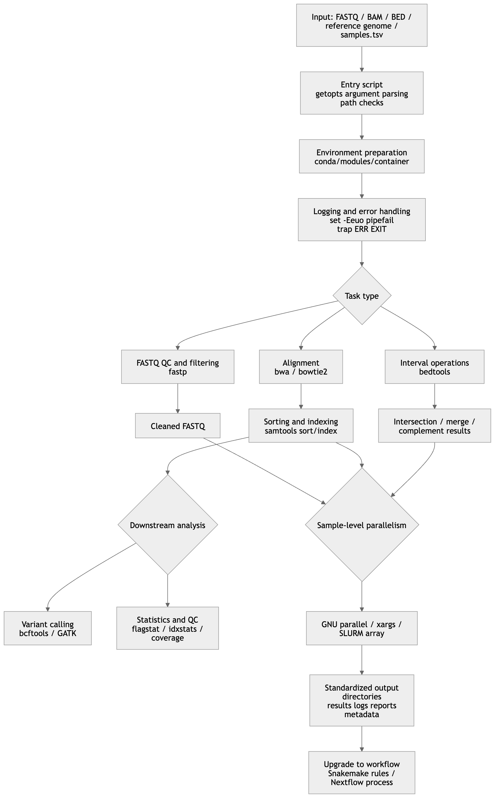

## Introduction

The value of Shell scripting for bioinformatics researchers is not merely that one can “write a few loops.” Its real value lies in the ability to organize text streams, exit codes, sorting and indexing, parallel execution, software environments, and reproducibility into stable analysis interfaces. On a single machine or an HPC cluster, Bash is extremely useful as a “glue layer.” When a pipeline evolves into a traceable DAG, needs deployment across environments, or needs reusable publication, it should naturally transition to Snakemake or Nextflow.

## General Principles

For bioinformatics, the most important Shell scripting mindset is “stream-centered” rather than “intermediate-file-centered.” Tools such as samtools are explicitly designed around stdin/stdout, and bedtools also commonly accepts standard input and writes results to standard output. Therefore, quality control, alignment, sorting, and interval operations can often be connected into pipelines that are faster and less error-prone. At the same time, Bash pipelines by default return only the exit status of the last command. If pipefail is not enabled, failure in an earlier command may be hidden.

For research scripts, reliability is usually more important than writing code that is short. The most basic engineering constraints include: quote variables by default to avoid word splitting and glob expansion; use mktemp for temporary files; use stable and predictable naming conventions for directory trees and filenames; explicitly preserve tab delimiters for BED/VCF/TSV files; and explicitly check whether sorting and indexing exist for formats that require them.

Bash is best suited as a “glue layer” and “task wrapper layer”: argument parsing, directory organization, logging, calling external programs, validating input, and summarizing status. It is not the ideal final form for complex dependency graphs. Snakemake abstracts an analysis into rules, input, output, and shell commands; Nextflow abstracts workflows into asynchronous channels, processes, containers, and failure-retry strategies. When sample numbers increase, environments become complex, or provenance must be tracked, a workflow manager is usually more robust than a very long Bash script.

## Knowledge Matrix

The following table covers the core knowledge areas required for Bash scripting in bioinformatics. Each item includes its purpose, key syntax, common pitfalls, a short example, and suggested priority.
<div style="overflow-x: auto;">

| Module                                | Definition / Purpose                                                                | Key Commands or Syntax                                                                                                                                                                                | Common Pitfalls and Best Practices                                                                                                                                                                                                                | Short Example                                                                                                   | Use Case and Priority                                                                                                                                                        |                                                                                                                                                |                                                                                      |                                                                               |
| ------------------------------------- | ----------------------------------------------------------------------------------- | ----------------------------------------------------------------------------------------------------------------------------------------------------------------------------------------------------- | ------------------------------------------------------------------------------------------------------------------------------------------------------------------------------------------------------------------------------------------------- | --------------------------------------------------------------------------------------------------------------- | ---------------------------------------------------------------------------------------------------------------------------------------------------------------------------- | ---------------------------------------------------------------------------------------------------------------------------------------------- | ------------------------------------------------------------------------------------ | ----------------------------------------------------------------------------- |
| Basic Shell syntax                    | Allows scripts to reliably pass arguments, assemble commands, and check status      | `#!/usr/bin/env bash`, variable expansion `${var}`, command substitution `$(...)`, arithmetic expansion `$(( ))`, conditions `[[ ]]` / `[ ]`, exit code `$?`, arguments `$@`                          | Quote variables by default; unquoted `$(...)` may undergo word splitting again; `[[ ]]`, arrays, and process substitution are Bash features, not POSIX `sh`                                                                                       | `sample="A B"; printf '%s\n' "$sample"; n=$(wc -l < file.txt)`                                                  | All scripts; essential for beginners                                                                                                                                         |                                                                                                                                                |                                                                                      |                                                                               |
| Common commands                       | Daily building blocks of the “glue layer”                                           | `printf`, `read -r`, `mapfile/readarray`, `sort`, `uniq`, `head`, `tail`, `wc`, `find`, `xargs`, `gzip`, `tar`                                                                                        | Prefer `printf` over `echo` for structured output; large-file sorting often benefits from `LC_ALL=C`; file lists should prefer `find -print0                                                                                                      | xargs -0`                                                                                                       | `LC_ALL=C sort -k1,1 -k2,2n in.bed                                                                                                                                           | uniq > out.bed`                                                                                                                                | Text cleaning and metadata organization; essential for beginners                     |                                                                               |
| Text processing                       | Main battlefield for FASTA/FASTQ/VCF/BED/TSV handling                               | `awk` for column-based processing and state logic; `sed` for line editing and replacement; `grep -F/-E` for searching; `cut` for fixed-column extraction; `perl -ne/-pe` for complex regex one-liners | BED/TSV are tab-delimited, so avoid casual space splitting; use `grep -F` for fixed strings; `awk` is often clearer than chained `cut                                                                                                             | sed                                                                                                             | grep`; Perl one-liners are powerful but require careful quoting                                                                                                              | `awk 'BEGIN{OFS="\t"} $3-$2>100 {print $1,$2,$3}' peaks.bed`                                                                                   | Table extraction, format conversion, annotation processing; beginner to intermediate |                                                                               |
| File and directory operations         | Keep input, output, cache, and temporary directories controlled                     | `mkdir -p`, `cp`, `mv`, `ln -s`, `find`, `mktemp`, `shopt -s nullglob`, `chmod`, `umask`                                                                                                              | Do not assume glob patterns always match; in an empty directory, `*.fastq.gz` may be passed literally; do not manually create `/tmp/foo.$$`, use `mktemp`; set permission strategies explicitly in shared environments                            | `tmpdir=$(mktemp -d); trap 'rm -rf "$tmpdir"' EXIT`                                                             | Batch sample directories, scratch space, cache; essential for beginners                                                                                                      |                                                                                                                                                |                                                                                      |                                                                               |
| Flow control                          | Use branches and loops to express sample logic                                      | `if/elif/else`, `case`, `for`, `while read -r`, `until`, `&&`, `                                                                                                                                      |                                                                                                                                                                                                                                                   | `                                                                                                               | In `cmd                                                                                                                                                                      | while read`, the loop body often runs in a subshell, so variable changes may be lost; prefer `while read ...; do ...; done < file`or`< <(...)` | `while IFS=$'\t' read -r s r1 r2; do printf '%s\n' "$s"; done < samples.tsv`         | Sample-sheet-driven scripts and conditional dispatch; essential for beginners |
| Functions and modularization          | Encapsulate repeated actions into reusable interfaces                               | `func() { ...; }`, `local`, `return`, `source`                                                                                                                                                        | Bash functions run in the current shell context; use `local` for local variables; reduce dependence on global variables; prefer arguments and return codes                                                                                        | `run_qc(){ local r1=$1 r2=$2; fastp -i "$r1" -I "$r2" -o /dev/null -O /dev/null; }`                             | Reusable “do the same thing for each sample” logic; intermediate                                                                                                             |                                                                                                                                                |                                                                                      |                                                                               |
| Argument and configuration management | Make scripts reusable, batchable, and teachable                                     | `getopts`, `${var:-default}`, `${var:?message}`, positional arguments, config files, environment variables                                                                                            | `getopts` does not automatically reset `OPTIND`; default values should be centralized; avoid hard-coding paths, thread numbers, and thresholds inside functions                                                                                   | `while getopts ':i:o:t:' opt; do case $opt in i) in=$OPTARG;; o) out=$OPTARG;; t) threads=$OPTARG;; esac; done` | Command-line wrappers; intermediate                                                                                                                                          |                                                                                                                                                |                                                                                      |                                                                               |
| Error handling and logging            | Make failures visible and debugging traceable                                       | `set -Eeuo pipefail`, `trap '...' ERR EXIT`, stderr redirection, `tee`, timestamped logs                                                                                                              | `set -e` has exceptions: `if` tests, `while` tests, `&&/                                                                                                                                                                                          |                                                                                                                 | `lists, non-final pipeline commands;`ERR`traps do not propagate into functions/command substitution unless`-E`/`errtrace` is used; keep log files separate from result files | `set -Eeuo pipefail; trap 'echo "[ERR] line=$LINENO" >&2' ERR`                                                                                 | All formal analysis scripts; essential for beginners                                 |                                                                               |
| Parallelization and batch processing  | Run independent sample-level tasks simultaneously                                   | Background jobs `&`/`wait`, `xargs -P`, `parallel -j`, SLURM `sbatch --array`                                                                                                                         | Avoid thread oversubscription: sample parallelism × tool-level threads can overload the system; parallel tasks must write to separate output paths; keep job logs and failure status; on HPC, match scheduler resource models                     | `parallel -j 4 --joblog log.tsv 'samtools flagstat {} > {.}.flagstat.txt' ::: *.bam`                            | Multi-sample QC, statistics, indexing; intermediate to advanced                                                                                                              |                                                                                                                                                |                                                                                      |                                                                               |
| Performance optimization              | Reduce I/O, process-start overhead, and sorting cost                                | Streaming pipelines, avoiding intermediate SAM files, `LC_ALL=C sort`, tool-level thread parameters such as `samtools -@`, `bwa -t`, `bowtie2 -p`                                                     | Superficial parallelism does not guarantee high performance; text sorting is affected by locale; avoid producing huge intermediate SAM files unnecessarily; pay attention to index type and scratch disk when references or chromosomes are large | `bwa mem -t 8 ref.fa R1.fq.gz R2.fq.gz                                                                          | samtools sort -@ 8 -o aln.bam`                                                                                                                                               | Large raw data and I/O-heavy pipelines; intermediate                                                                                           |                                                                                      |                                                                               |
| Portability and compatibility         | Control sensitivity to shell, platform, and tool implementation differences         | POSIX `sh` baseline, Bash-specific features, `find -exec ... +`, GNU/BSD differences, containers                                                                                                      | If targeting `/bin/sh`, avoid arrays, `[[ ]]`, process substitution, and `mapfile`; `find -print0` is useful, but historically less portable than `-exec ... +`; GNU and BSD `sed`/`find`/`xargs` options differ                                  | `find data -name '*.vcf.gz' -exec tabix -f {} +`                                                                | Shared clusters, multiple distributions, teaching examples; intermediate                                                                                                     |                                                                                                                                                |                                                                                      |                                                                               |
| Environment management                | Make software stacks reproducible across nodes and time                             | `conda export`, `conda env export`, `module load`, Apptainer/Docker                                                                                                                                   | Do not hide PATH modifications in `.bashrc` and expect others to reproduce them; shared clusters often use `module`; containers require attention to bind paths and host directories; environment files should be version controlled              | `module load samtools/1.23; conda env export --from-history > environment.yml`                                  | Clusters, multi-tool stacks, long-term projects; intermediate                                                                                                                |                                                                                                                                                |                                                                                      |                                                                               |
| Version control and reproducibility   | Bind scripts, environments, parameters, and results to traceable versions           | `git commit`, annotated tags, recording `git rev-parse` in logs, preserving `environment.yml`, profiles, or container images                                                                          | Reproducibility requires at least code version, parameters, software environment, input/output paths, and logs; annotated tags are preferable for release versions; scripts should write metadata files into output directories                   | `git tag -a v1.0.0 -m 'first stable release'`                                                                   | Papers, shared workflows, teaching; intermediate to advanced                                                                                                                 |                                                                                                                                                |                                                                                      |                                                                               |
| Testing and debugging                 | Find syntax, path, and logic errors before real execution                           | `bash -n`, `set -x`, `shellcheck`, Bats, Snakemake `-n`                                                                                                                                               | `set -x` is useful for tracing argument construction but should not expose keys or sensitive sample paths; `bash -n` checks syntax only; Bats is useful for regression testing Bash functions and CLI wrappers                                    | `bash -n pipeline.sh && shellcheck pipeline.sh`                                                                 | Production scripts, coursework, team collaboration; intermediate                                                                                                             |                                                                                                                                                |                                                                                      |                                                                               |
| Security and permissions              | Reduce risks of deletion, overwriting, permission leakage, and accidental execution | `umask`, `chmod`, writing only to project directories, explicit path checks, careful `rm -rf`                                                                                                         | Avoid destructive operations on empty variables; validate directory levels before deletion; do not casually use `chmod -R 777` in shared paths; avoid leaking sample identifiers in logs when working with clinical data                          | `[[ -n ${outdir:-} && $outdir == results/* ]]                                                                   |                                                                                                                                                                              | { echo "bad outdir" >&2; exit 1; }`                                                                                                            | Shared servers and sensitive data; intermediate                                      |                                                                               |

</div>

## Bioinformatics Tool and Workflow Integration

The following table places common bioinformatics tools back into the context of “how Shell drives them.” The key is not memorizing commands, but understanding which tools are suitable for streaming, which depend on sorting/indexing, which are good workflow nodes, and which require versions and environments to be explicitly recorded.

| Tool / System      | Typical Role in Scripts                                                                        | Key Commands or Parameters                                                              | Common Pitfalls and Best Practices                                                                                                                                                                                                     | Priority |
| ------------------ | ---------------------------------------------------------------------------------------------- | --------------------------------------------------------------------------------------- | -------------------------------------------------------------------------------------------------------------------------------------------------------------------------------------------------------------------------------------- | -------- |
| `samtools`         | Conversion, sorting, indexing, region extraction, and streaming for SAM/BAM/CRAM               | `view`, `sort`, `index`, `mpileup`, `faidx`                                             | Naturally suited to pipelines; BAM files used for indexing must be coordinate-sorted; if chromosome coordinates may exceed 512 Mbp, consider CSI rather than default BAI                                                               | Highest  |
| `bcftools`         | Variant calling, filtering, annotation, indexing, and VCF/BCF manipulation                     | `mpileup`, `call -m`, `view -i`, `filter`, `index`                                      | Modern workflows usually use the multiallelic model `call -m`; fixed-threshold filtering is only a starting point, not a universal truth; write filter expressions as script variables for version tracking                            | Highest  |
| `bedtools`         | Interval set operations for BED/GFF/VCF/BAM                                                    | `intersect`, `merge`, `complement`, `coverage`                                          | `merge` requires pre-sorted input; `-sorted` can reduce memory use for large files; many subcommands support stdin/stdout and combine well with `awk`/`sort`                                                                           | Highest  |
| `fastp`            | FASTQ quality control, filtering, and report output                                            | Input `-i/-I`, output `-o/-O`, reports `-h/-j`                                          | Keep report directories, filtered FASTQ files, and logs separate; batch jobs should have independent sample outputs to avoid parallel conflicts; record `fastp --version`                                                              | High     |
| `bwa`              | Reference indexing and short-read alignment                                                    | `bwa index`, `bwa mem -t`, `-R`, sometimes `-M`                                         | `bwa mem` is commonly used for high-quality reads and longer sequences; `-M` is often used for downstream Picard/GATK compatibility; read group `-R` should be assembled explicitly in scripts                                         | High     |
| `bowtie2`          | Reference indexing and alignment, especially in established pipelines                          | `bowtie2-build`, `bowtie2 -x`, `-1/-2`, `-U`, `-p`                                      | `-x` uses the index basename; memory use increases with `-p`; local vs end-to-end alignment should match the analysis goal                                                                                                             | High     |
| `htslib` toolchain | BGZF compression, tabix/CSI indexing, FASTA random access                                      | `bgzip`, `tabix`, `samtools faidx`                                                      | `tabix` requires position-sorted and bgzip-compressed input; `.tbi` and BAI are limited by 512 Mbp coordinates, so use `.csi` for very long coordinates; compression and indexing should be scripted as paired steps                   | High     |
| `GATK`             | More standardized variant discovery and filtering, especially for short variant best practices | `HaplotypeCaller`, `SelectVariants`, `VariantFiltration`                                | `HaplotypeCaller` uses local de novo assembly and is suitable for rigorous variant discovery; true Best Practices involve much more than a single command; teaching templates should clearly state “demo version ≠ full best practice” | High     |
| Snakemake          | Rule-based DAG workflow management                                                             | `rule`, `input`, `output`, `shell`, `log`, `conda`, `container`, `snakemake -n --cores` | Clear rule definitions, strong dry-run behavior, mature parallel scheduling; suitable for upgrading Bash modules into traceable workflows; logs should be explicit rule attributes                                                     | High     |
| Nextflow           | Channel/process-based scalable workflow management                                             | `channel.fromPath()`, `process`, `errorStrategy`, `maxRetries`, container configuration | Processes terminate on failure by default but can retry or ignore failures; strong for multi-environment deployment, cloud/HPC scaling, and cache recovery; its mental model differs from linear Bash pipelines                        | High     |


When integrating these tools into Shell scripts, the three most common and most important patterns are:

First, pure streaming, such as bwa mem | samtools sort.

Second, sort-then-index, such as BED/VCF/BAM sort → index → region access.

Third, sample-level parallelization, where the same command template is applied to every sample using parallel, xargs -P, or scheduler arrays.

Bash scripts that deviate far from these three patterns usually become complex very quickly.


### Comparison of Common Parallelization Methods

| Method           | Suitable Granularity                                                   | Strengths                                                                                                                            | Limitations / Pitfalls                                                                                                            | Common Bioinformatics Use Cases                                                          | Recommendation                                     |
| ---------------- | ---------------------------------------------------------------------- | ------------------------------------------------------------------------------------------------------------------------------------ | --------------------------------------------------------------------------------------------------------------------------------- | ---------------------------------------------------------------------------------------- | -------------------------------------------------- |
| `xargs -P`       | Local multi-process execution driven by argument lists                 | Almost always available; works well with `find`; suitable for “one command + many arguments”                                         | Defaults to whitespace splitting, so use `-0` for filenames with spaces/newlines; output order is unstable; weak failure recovery | Batch `samtools flagstat`, batch `tabix`, batch compression/indexing                     | Good first choice for small to medium simple tasks |
| GNU `parallel`   | Local or multi-node batch execution with complex argument substitution | `-j`, `-k`, `--joblog`, `--resume-failed`, and `--halt soon,fail=1` are very suitable for research batch jobs                        | Requires separate installation; excessive parallelism can conflict with tool-level threads; teams should standardize usage        | Multi-sample `fastp`, sample-sheet-driven BAM/VCF statistics, parameter-grid experiments | Preferred tool for sample-level parallelism        |
| SLURM job arrays | Cluster-level batch processing                                         | Matches scheduler resource management; supports concurrency limits with `%`; works with dependencies and array environment variables | Requires batch scripts; output, retry, and array-index mapping must be standardized                                               | Large sample queues and thousands of independent jobs                                    | Preferred method on HPC                            |


### Comparison of Common Text Processing Tools

| Tool   | Strengths                                                                                | Weaknesses                                                                             | Best Bioinformatics Use                                          | Not Recommended For                                                | Recommendation                               |
| ------ | ---------------------------------------------------------------------------------------- | -------------------------------------------------------------------------------------- | ---------------------------------------------------------------- | ------------------------------------------------------------------ | -------------------------------------------- |
| `awk`  | Column-oriented; naturally suitable for TSV/BED/VCF; supports conditions and aggregation | Complex state machines can become hard to read                                         | BED/TSV reshaping, filtering, statistics, adding columns         | Replacing a full scripting language with a very long `awk` program | Default first choice                         |
| `sed`  | Strong for line-by-line replacement and range selection                                  | Weak for field-based logic; less suitable than `awk` for structured tables             | Batch header editing, removing comments, range editing           | Complex multi-column logic                                         | Best used as a linear text editor            |
| `cut`  | Very fast and semantically simple                                                        | Only handles fixed columns; not flexible for variable whitespace or complex delimiters | Extracting fixed columns such as the first few VCF/TSV columns   | Complex filtering                                                  | Excellent for simple fixed-column extraction |
| `grep` | Direct pattern searching; `-F` is efficient for fixed strings                            | Not suitable for column operations or complex rearrangement                            | Checking headers, sample names, log keywords                     | Replacing `awk` for table logic                                    | Use primarily for searching                  |
| `perl` | Very powerful regex and one-liner capabilities; more general than `sed`/`awk`            | Team readability is often lower; shell quoting is more error-prone                     | Complex substitution, cross-column regex, quick in-place editing | Writing the whole pipeline as scattered one-liners                 | Use only when clearly needed                 |


From a teaching and research-maintenance perspective, the most stable order is usually: use awk first for structured table problems, grep for searching, and sed for pure text editing. Introduce Perl one-liners only when these tools become clearly awkward. This significantly reduces future readability costs.

Typical Evolution from Script to Workflow

The following diagram shows a typical evolution path from Bash modules to workflow systems. Input parameters enter a script wrapper layer, followed by QC, alignment, sorting/indexing, variant or interval analysis. Sample-level parallelization occurs across these steps, while error handling, logging, and environment isolation act as cross-cutting concerns. Snakemake’s rule model and Nextflow’s process/channel model essentially make these modular Bash nodes explicit.



## Complete Script Templates

The following scripts assume a Linux + Bash environment. Their goal is not to replace fully validated production pipelines, but to provide research-oriented templates that are teachable, reusable, and extensible. Each script makes the following practices explicit: parameters, directories, logs, error handling, and output naming.

## Batch FASTQ Quality Control and Filtering

Dependencies: bash, fastp

Input convention: paired files named sample_R1.fastq.gz and sample_R2.fastq.gz under the raw/ directory.

Purpose: This is suitable as a project entry script responsible only for FASTQ cleaning and report generation. Since fastp can output both HTML and JSON reports, it is useful to separate result data from quality reports.

```bash
#!/usr/bin/env bash
set -Eeuo pipefail

# Usage:
#   ./batch_fastp.sh raw_dir clean_dir report_dir threads
# Example:
#   ./batch_fastp.sh raw clean reports 8

raw_dir="${1:-raw}"
clean_dir="${2:-clean}"
report_dir="${3:-reports}"
threads="${4:-4}"
log_dir="logs"

mkdir -p "$clean_dir" "$report_dir" "$log_dir"

log() {
    printf '[%(%F %T)T] %s\n' -1 "$*" >&2
}

trap 'log "ERROR: line $LINENO"; exit 1' ERR

# Avoid passing literal *.fastq.gz when the directory is empty
shopt -s nullglob

r1_files=("$raw_dir"/*_R1.fastq.gz)

if [[ ${#r1_files[@]} -eq 0 ]]; then
    log "No *_R1.fastq.gz files found in: $raw_dir"
    exit 1
fi

for r1 in "${r1_files[@]}"; do
    sample="$(basename "$r1" _R1.fastq.gz)"
    r2="$raw_dir/${sample}_R2.fastq.gz"

    if [[ ! -f "$r2" ]]; then
        log "Missing paired file: $r2"
        exit 1
    fi

    out1="$clean_dir/${sample}_R1.clean.fastq.gz"
    out2="$clean_dir/${sample}_R2.clean.fastq.gz"
    html="$report_dir/${sample}.fastp.html"
    json="$report_dir/${sample}.fastp.json"
    logfile="$log_dir/${sample}.fastp.log"

    log "Processing sample: $sample"

    fastp \
        -i "$r1" \
        -I "$r2" \
        -o "$out1" \
        -O "$out2" \
        -h "$html" \
        -j "$json" \
        -w "$threads" \
        >"$logfile" 2>&1

    log "Finished sample: $sample"
done

log "All samples completed"

```

This template demonstrates four habits beginners should develop early. First, separate data, reports, and logs into different directories. Second, explicitly validate paired input files. Third, avoid implicit assumptions about glob behavior. Fourth, write the “single-sample action” as a replaceable template that can later be handed to GNU Parallel or a workflow system.